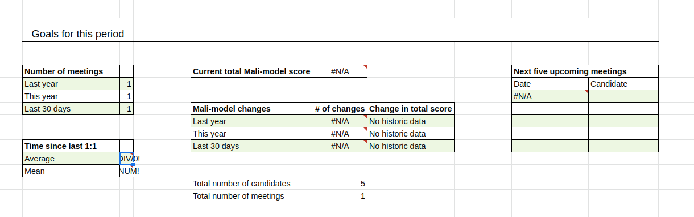
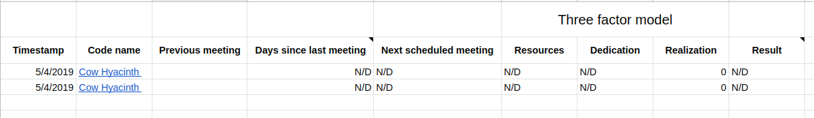
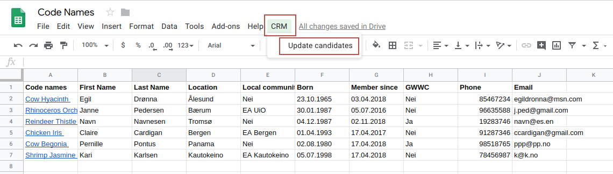
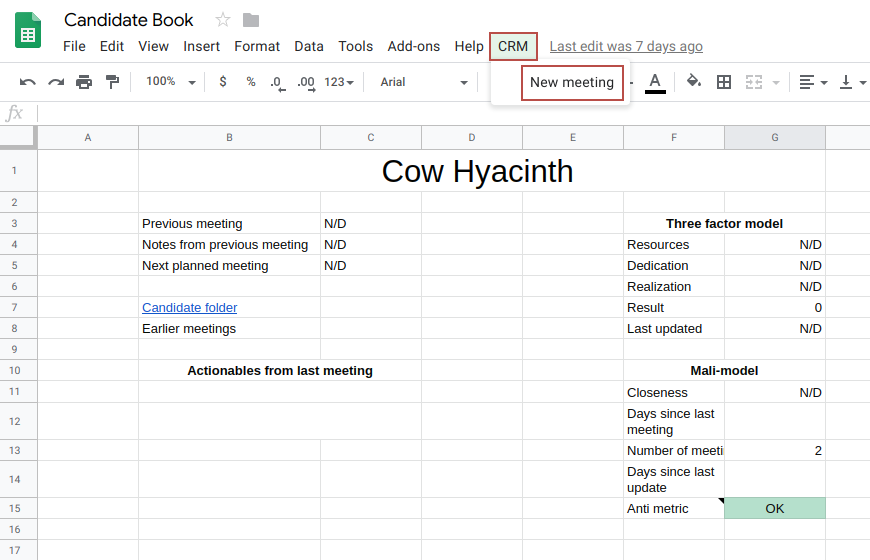
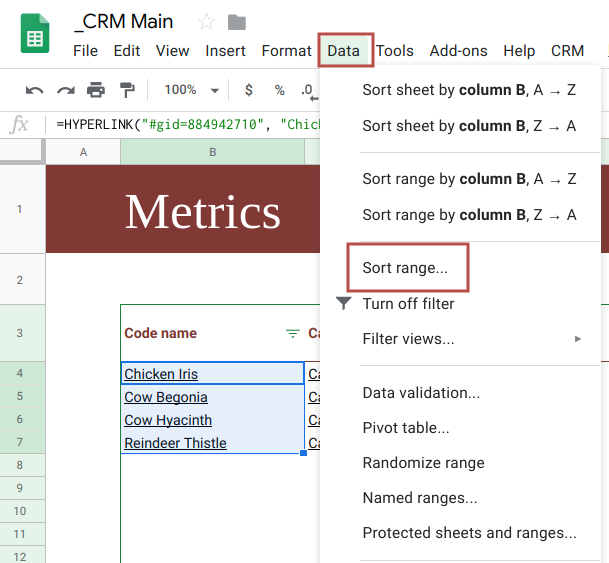
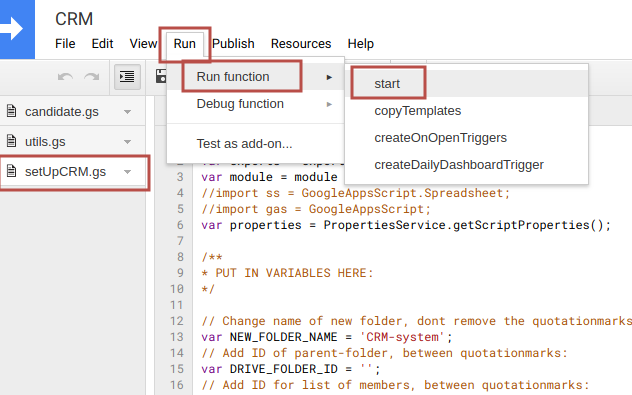
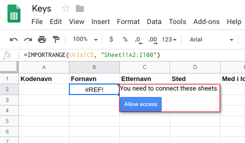
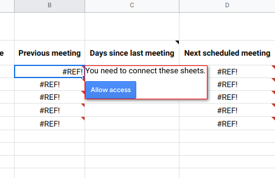

# Table of content
1. [About CRM](#aboutCRM)
1. [Use CRM system](#useCRM)
1. [FAQ](#FAQ)
1. [Setup of CRM](#setupCRM)
1. [Extra](#extra)

# CRM 

A CRM system in Google App Script developed by Effective Altruism Norway.
The goal of this CRM system is to streamline 1-1 meetings.

1. Uses spreadsheets and documents in Google Suite
1. Makes it easy to plan 1:1 meetings for career guiding etc.
1. Easy to adjust to your own needs
1. See how well you're succeeding

### Versions
There are currently two versions of this code. One in Google App Script and one in TypeScript. This folder contains the code in App Script which makes it easy to copy/paste code directly into Google App Script. See [Setup of CRM](#setupCRM) for tutorial. 

Here is a [link](https://github.com/EANorgeService/CRMsetup) for the code in TypeScript, use this for local development and use [clasp](https://github.com/google/clasp/) to upload code to Google App Script. 

### Folder structure

It is possible to set up the system with code names of candidates, instead of their real names.
These folders have code names generated by http://www.codenamegenerator.com/.

### CRM Main Spreadsheet
The Main Sheet gives you an overview of results from your 1:1 meetings.
With some basic understanding of spreadsheets you can add your own measurements of success.

#### Metrics sheet
The Metrics Sheet gives you an overview of each candidate.

#### Planner
See all meetings you have planned, and click on each candidate to prepare for the next meeting.

### Candidate Book Spreadsheet
Each candidate gets their own sheet, this makes it easy to prepare for the next meeting.

#### Meetings
Overview over all meetings you've had.

#### Candidate sheet
Example of the candidate sheet:

### Keys spreadsheet
You can choose if you want to use real names for candidates or code names. The Keys spreadsheet copies all information from a list of members.

### Hidden sheets
Some sheets only exist to give information needed by the code.

##### Urls
All spreadsheets have a sheet called Urls. This includes URLs to all Spreadsheets in the system, which makes it easier to connect all Spredsheets.

##### Dashboard historic data
Sheet that could be useful for gathering data. Can be used when calculating measurements of success.

### Meetings folder
Notes for all meetings are saved in the meetings folder for each candidate.

#### Example of notes for a meeting

# Use the CRM system 

### Add candidates
In the Google Drive Folder with the CRM system open the Keys Spreadsheet. A good tool for finding code names is www.codenamegenerator.com.
After you have added code names click **CRM > Update candidates**. Only members/candidates with code names will be added to the system.

Example of how the Keys sheets could look with code names.

### Plan meetings and create meeting notes
Go to the candidate sheet of the candidate you want to plan a meeting with. Click **CRM > Meeting**

# FAQ 
### What do I need to know to edit the code?
Changes to the code can be written in either [Javascript](https://github.com/EANorgeService/CRMsetup) or [Typescript](https://github.com/EANorgeService/CRM) and basic knowledge in one of these languages is necessary.

### Can I change the names of Spreadsheets or sheets?
The names of the Spreadsheets *can be changed*. Unfortunately the names of the sheets within the Spreadsheets *can not be changed* without also changing them in the code. Also the folders with the code names of each candidate *can not be changed*.

### Update list of members
It is possible to change the list of members, but if any candidates are added they will only be partly deleted from the system, folders and sheets have to be manually deleted. The CRM setup makes a copy of wanted member list. This copy will not automatically update.  

### Sort code names in alphabetical order
To sort the code names list alphabetically select the column with the code names(or another column you wish to sort) and click **data -> sort selection**.

# Set up the CRM system 

## Needed to set up CRM system
1. Access to CRMsetup [folder](https://github.com/EANorgeService/CRMsetup) in GitHub.
1. Access to CRMtemplates [folder](https://drive.google.com/drive/folders/1fcHDHTCHAwwFkLSWX1SwQ-gZExy5NBI5?usp=sharing) in Google Drive.
1. Access to the Google Drive Folder where you want your CRM system.
1. Access to a list of all your members, or another list including the people you want as candidates in you system. You can later choose who you want to include from the given list. From now on this list will be called the member list.

## Alternative 1: Local development
If you don't want to change the code, or your not used to the terminal skip to the next section.
Do this if you want to change the code or you know the basics of using a terminal, else the easiest way is to copy/paste.
To download the code for GitHub use [git](https://git-scm.com/book/en/v2/Getting-Started-Installing-Git).
Use [clasp](https://github.com/google/clasp/) to uploade code to Google App Script. Clasp also makes it possible to write code in typescript.

## Alternative 2: Copy/paste code to Google App Script
If you haven't used a terminal before the easiest way to transfer the code to Google App Script is to copy/paste the code from GitHub to Google App Script.
Be sure go get all code from GitHub, and paste it in to three different scripts in the same project.

#### Create a new project on script.google.com
Log in with the correct user to google and go to Google App Script: script.google.com.
Make a new project by clicking "New Script", and give the new project a descriptive name for instance CRMsystem.

Make two additional scripts in the project you just made and give all scrips the same names as they have in GitHub: candidate, utils and CRMsetup.

Delete all default code from all three scripts

#### Copy code from GitHub
Open these files on [GitHub](https://github.com/EANorgeService/CRMsetup): candidate.js, utils.js and setUpCRM.js, copy all code from them and paste code to the three different scripts you just made in Google App Script.

#### Paste all code in to three different scripts in Google
Be sure to paste code from GitHub in to three different scripts, check that you got all code.

Save all three scripts.

## Setup
After copying and pasting all three files from GitHub to Google App Script the CRM-system can be set up in a destination folder on your google drive.

### Step 1: Enable Advanced Drive Service
In the project you just made on google.script.com click **Resources > Advanced Google Services** scroll down to **Drive** and enable it.

### Step 2: Add ID for destination folder to setUpCRM.js
The CRM system should be set up in a secure location and has to be in a Google Drive folder you have access to. Decide where you want the CRM-system to be set up, and find the ID of that Google Drive folder. Copy this ID, do not include the backslashes.

Go to the script called setUpCRM.js, and add the ID to **DRIVE_FOLDER_ID**, add the ID between quotationmarks, do not delete the quotationmarks.

Remember to save the script and do not delete the quotationmarks.

### Step 3: Add ID for file with list of members to setUpCRM.js
Find or make a google Spreadsheet with a list of your community members. You can later choose from this list who you want to add as candidates to the system. Be careful to not include the last part of this URL
[This is an example](https://docs.google.com/spreadsheets/d/1PEZhv7JwFeFfu8oeloPuxFmHMNCop2YdguYI1G0g4io/edit?usp=sharing) of such a list, if your only trying the system you can use this list as you member list.
The script will add a copy of this list of members to the new folder with the CRM system.
Find the ID of the list, do not include the backslashes.

Go to the script called setUpCRM.js, and add the ID to **MEMBERLIST_ID**, add the ID between quotationmarks.

Remember to save the script and not delete the quotationmarks.

### Step 4: Try to run start() function
Be sure all scripts are saved.
When you've added ID for destination folder and for list of members make sure you are in the setUpCRM.js file and click **Run > Run function > start**
NB: you need to review authorization, see picture below.
If you can not find the function start you might be in the wrong file.
The CRM system is not a published app nor is it verified by google. Therefore google needs permission to run the app.

This might pop up:

Click review permission and allow.

Now google will tell you that the CRM system is not an app verified by them

Click **Advanced > Go to CRM(unsafe)**

### Step 5: Run start() function
After reviewing permission and allowing the CRM system access and approving that you know and trust the app/developer you need to run the start function again.

Make sure you are in the setUpCRM.js file and click **Run > Run function > start**.
If you can not find the function **start** you might be in the wrong file.

### Step 6: Connect list of Members and Keys
Go to the folder where the CRM system in now set up. Open the file Keys, connect it to the list of members by clicking **#REF > Allow access**

### Step 7: Add code names for candidates
While still in the Keys Spreadsheet after doing step 5 add code names to you candidates. A good tool for finding code names is www.codenamegenerator.com.
After you have added code names click **CRM > Update candidates**. Only members/candidates with code names will be added to the system.

Example of how the Keys sheets could look with code names.

### Step 8: Connect Main Spreadsheet and Candidate book Spreadsheet
Open the Spreadsheet CRM main, find the sheet called metrics click **#REF > Allow access**

## Troubleshoot

### No items with the given ID could be found

This error means that one of the id's are wrong. It is probably the ID for the destination folder that is missing.

### Invalid argument: parent

This means that an ID for a folder is the ID for something else than a folder. Check again that the ID for the destination folder is correct.

### Access denied DriveApp

This means that you don't have access to, or that the ID to a file is wrong. Check again that the Id for the member list is correct.

### We're sorry a server error occurred

This probably means that an ID for a file is missing, check again that you added the ID for the member list.

### It is not the member list ID and not the destination folder ID!
1. Double check that you use the correct google account when *editing* the scripts, it says what account you use in the top right corner.
1. The code was not copied correctly from GitHub.
1. There is a mistake in the template folder :( Contact EA Norway: service@effektivaltruisme.no
1. There is a mistake in the code :( Contact EA Norway: service@effektivaltruisme.no

# Extra 

## Add a form to the CRM system
EA Norway has a form candidates fill out before the first conversation and on form each candidate fills out after each conversation.
Questions and answers can easiøy be added to each candidate's personal sheet. Here is an example.
[Form in Candidate Sheet](images/formCandidateSheet)

### How to only see some questions from the form
